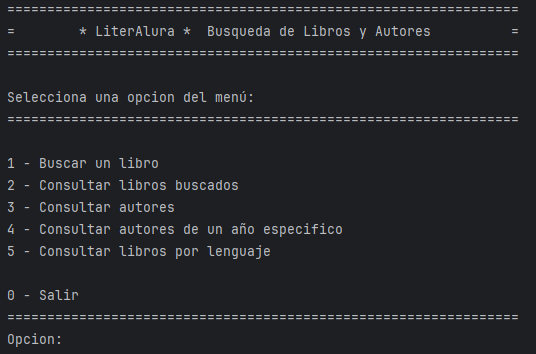
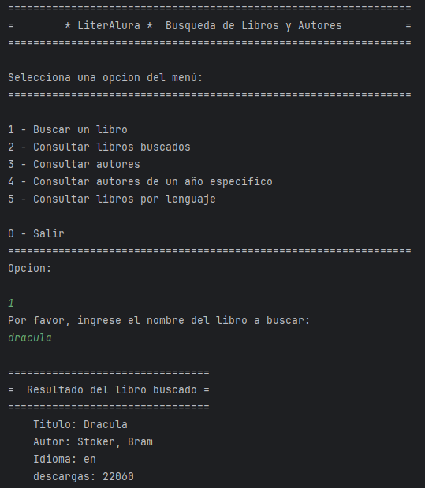
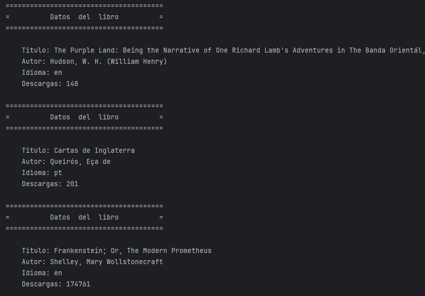
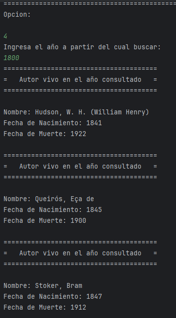
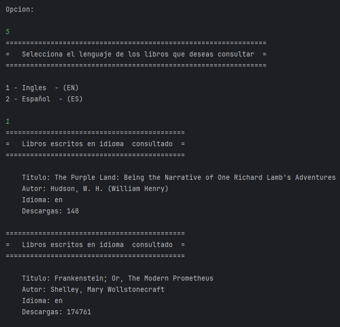
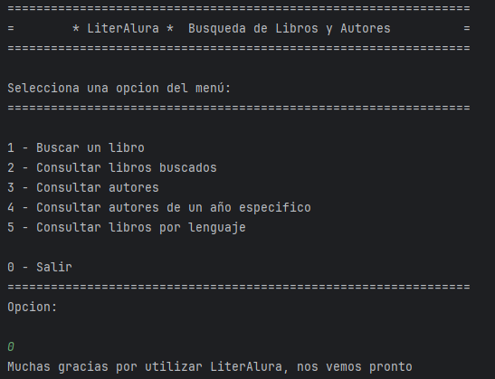

# **LiteraAlura** 

**LiteraAlura** Parte de un desafío del curso de Java y Spring Framework y consiste en una aplicación en realizada en Java para consultar un catálogo de autores y libros.

La aplicación realiza **búsquedas en una API externa,** de libros y sus autores. 

La aplicación utiliza la API de [Gutendex](https://gutendex.com/ "API para libros de dominio público") 📜, para obtener datos de libros, a través de la cual se obtienen respuestas en formato JSON, que serán almacenados en una base de datos PostgreSQL,

Los resultados obtenidos de la búsqueda y almacenados en nuestra base de datos, se filtran y muestran utilizando el menú de la aplicación y la salida es la consola.

## 🛠 Tecnologías Utilizadas🛠

- **Java 23**
- **PostgreSQL**
- **Spring Boot**
- **Hibernate**

### 📝Capturas de pantalla de la aplicación funcionando

Al ejecutar la aplicación se inicia el menú principal en la consola, al cual puede accederse tipeando el número de opcion correspondiente.

La primer opción correponde a la búsqueda por título del libro en la base de datos de la API de Gutendex, generando resultados en caso de existir la equivalencia o devolviéndo el mensaje que no fue encontrado el libro solicitado. 

La segunda opción nos muestra el listado de los libros que fueron buscados y guardados en nuestra báse de datos propia de la aplicación.

La cuarta opción del menú, permite consultar entre las consultas que fuimos realizando, un autor que haya estado vivo a partir de un año en particular, que será ingresado en el segundo paso de la opción solicitada.

La última opción del menú de la aplicación, permite cosultar libros por idioma, pudiendo seleccionar entre Inglés y Español, también en una segunda instancia de menú.

Para salir de la aplicación y terminar, se pulsa el número 0, con un mensaje de despedida

## ‍💻Realizado por Alberto Buituron

